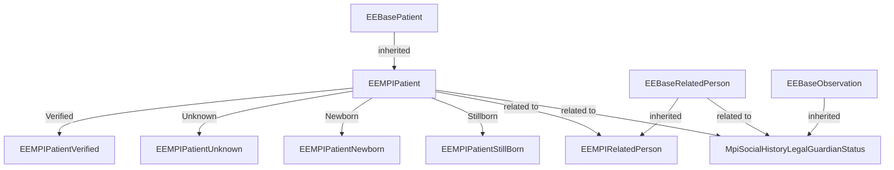
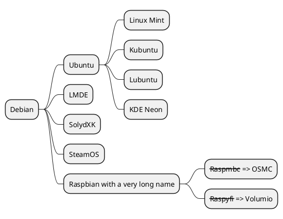

# Purpose
This page demonstrate different markdown usage possibilities.

### Highlight
You can higlight `some words` or express them as **bold**, _italic_ or
```
place some text in the box
```
or have
- a bullets
  - or subbulets
- read more in the tutorial: [basic](https://tutorial.termx.org/en/basic-markdown-syntax) features and [advanced](https://tutorial.termx.org/en/extended-markdown-syntax) features.


### JSON example


```json
{
    "id": 1,
    "name": "Igor"
}
```

### Mermaid example



### PlantUML examples

```plantuml
Bob->Alice : Hello
Bob <-- Alice: Hello. Please visit https://plantuml.com/
```




### Draw.io example

```drawio
PD94bWwgdmVyc2lvbj0iMS4wIiBlbmNvZGluZz0iVVRGLTgiPz4KICAgICAgPCFET0NUWVBFIHN2ZyBQVUJMSUMgIi0vL1czQy8vRFREIFNWRyAxLjEvL0VOIiAiaHR0cDovL3d3dy53My5vcmcvR3JhcGhpY3MvU1ZHLzEuMS9EVEQvc3ZnMTEuZHRkIj4KICAgICAgPHN2ZyB4bWxucz0iaHR0cDovL3d3dy53My5vcmcvMjAwMC9zdmciIHhtbG5zOnhsaW5rPSJodHRwOi8vd3d3LnczLm9yZy8xOTk5L3hsaW5rIiB2ZXJzaW9uPSIxLjEiIHdpZHRoPSI1MXB4IiBoZWlnaHQ9Ijk4cHgiIHZpZXdCb3g9Ii0wLjUgLTAuNSA1MSA5OCIgY29udGVudD0iJmx0O214ZmlsZSBob3N0PSZxdW90O2VtYmVkLmRpYWdyYW1zLm5ldCZxdW90OyBtb2RpZmllZD0mcXVvdDsyMDIzLTEwLTE2VDEwOjIxOjU0LjA5MFomcXVvdDsgYWdlbnQ9JnF1b3Q7TW96aWxsYS81LjAgKE1hY2ludG9zaDsgSW50ZWwgTWFjIE9TIFggMTBfMTVfNykgQXBwbGVXZWJLaXQvNjA1LjEuMTUgKEtIVE1MLCBsaWtlIEdlY2tvKSBWZXJzaW9uLzE3LjAgU2FmYXJpLzYwNS4xLjE1JnF1b3Q7IGV0YWc9JnF1b3Q7Y0xFSlVyN0U2OEgtTkdVOUkzU00mcXVvdDsgdmVyc2lvbj0mcXVvdDsyMi4wLjQmcXVvdDsgdHlwZT0mcXVvdDtlbWJlZCZxdW90OyZndDsmbHQ7ZGlhZ3JhbSBpZD0mcXVvdDtjNDV0eUZiWU9fR1ZMNVdKb1BXRCZxdW90OyBuYW1lPSZxdW90O1BhZ2UtMSZxdW90OyZndDtqWkpOYjRNd0RJWi9EWGNnRysyT0hldTZ3eVpONm1IbkZEeUlsR0FVVElIOStvWEdmS21hdEZPY3g2OFRmd1VpTmYzSnlycjh3QngwRUlkNUg0aVhJSTZqOEhIdmpwRU1uaVJKNUVGaFZjNmlCWnpWRDB5UlRGdVZRN01SRXFJbVZXOWhobFVGR1cyWXRCYTdyZXdiOWZiWFdoWndCODZaMVBmMFMrVlVlcnFQZHd0L0ExV1UwODlSOHVROVJrNWlycVFwWlk3ZENvbGpJRktMU040eWZRcDZiTjdVRngvMytvZDNUc3hDUmY4SmlIM0FWZXFXYXp0a2hGWndkalJNSmJ0RTY5RnNqYjRwQXZGOEJVdktOZVZkWGtCL1lxTklZZVVrRnlSQ3N4SWN0Q3BHQjJIdGFFbEd1MHZrVEd4SnF3clNlVXloZy9jbGNGWGpjOUN2RUpkMEFqUkFkbkFTOXU2NHU3eGVEM3p0bGxrSlJ1VnFUQWt6eWR0UnpPOHVEWFFHOTNDNkxyTzYrVlliTDQ2LyZsdDsvZGlhZ3JhbSZndDsmbHQ7L214ZmlsZSZndDsiIHN0eWxlPSJiYWNrZ3JvdW5kLWNvbG9yOiByZ2IoMjU1LCAyNTUsIDI1NSk7Ij48ZGVmcy8+PGc+PGVsbGlwc2UgY3g9IjI1IiBjeT0iMTUuNSIgcng9IjcuNSIgcnk9IjcuNSIgZmlsbD0icmdiKDI1NSwgMjU1LCAyNTUpIiBzdHJva2U9InJnYigwLCAwLCAwKSIgcG9pbnRlci1ldmVudHM9ImFsbCIvPjxwYXRoIGQ9Ik0gMjUgMjMgTCAyNSA0OCBNIDI1IDI4IEwgMTAgMjggTSAyNSAyOCBMIDQwIDI4IE0gMjUgNDggTCAxMCA2OCBNIDI1IDQ4IEwgNDAgNjgiIGZpbGw9Im5vbmUiIHN0cm9rZT0icmdiKDAsIDAsIDApIiBzdHJva2UtbWl0ZXJsaW1pdD0iMTAiIHBvaW50ZXItZXZlbnRzPSJhbGwiLz48ZyB0cmFuc2Zvcm09InRyYW5zbGF0ZSgtMC41IC0wLjUpIj48c3dpdGNoPjxmb3JlaWduT2JqZWN0IHBvaW50ZXItZXZlbnRzPSJub25lIiB3aWR0aD0iMTAwJSIgaGVpZ2h0PSIxMDAlIiByZXF1aXJlZEZlYXR1cmVzPSJodHRwOi8vd3d3LnczLm9yZy9UUi9TVkcxMS9mZWF0dXJlI0V4dGVuc2liaWxpdHkiIHN0eWxlPSJvdmVyZmxvdzogdmlzaWJsZTsgdGV4dC1hbGlnbjogbGVmdDsiPjxkaXYgeG1sbnM9Imh0dHA6Ly93d3cudzMub3JnLzE5OTkveGh0bWwiIHN0eWxlPSJkaXNwbGF5OiBmbGV4OyBhbGlnbi1pdGVtczogdW5zYWZlIGZsZXgtc3RhcnQ7IGp1c3RpZnktY29udGVudDogdW5zYWZlIGNlbnRlcjsgd2lkdGg6IDFweDsgaGVpZ2h0OiAxcHg7IHBhZGRpbmctdG9wOiA3NXB4OyBtYXJnaW4tbGVmdDogMjVweDsiPjxkaXYgZGF0YS1kcmF3aW8tY29sb3JzPSJjb2xvcjogcmdiKDAsIDAsIDApOyAiIHN0eWxlPSJib3gtc2l6aW5nOiBib3JkZXItYm94OyBmb250LXNpemU6IDBweDsgdGV4dC1hbGlnbjogY2VudGVyOyI+PGRpdiBzdHlsZT0iZGlzcGxheTogaW5saW5lLWJsb2NrOyBmb250LXNpemU6IDEycHg7IGZvbnQtZmFtaWx5OiBIZWx2ZXRpY2E7IGNvbG9yOiByZ2IoMCwgMCwgMCk7IGxpbmUtaGVpZ2h0OiAxLjI7IHBvaW50ZXItZXZlbnRzOiBhbGw7IHdoaXRlLXNwYWNlOiBub3dyYXA7Ij5BY3RvcjM8L2Rpdj48L2Rpdj48L2Rpdj48L2ZvcmVpZ25PYmplY3Q+PHRleHQgeD0iMjUiIHk9Ijg3IiBmaWxsPSJyZ2IoMCwgMCwgMCkiIGZvbnQtZmFtaWx5PSJIZWx2ZXRpY2EiIGZvbnQtc2l6ZT0iMTJweCIgdGV4dC1hbmNob3I9Im1pZGRsZSI+QWN0b3IzPC90ZXh0Pjwvc3dpdGNoPjwvZz48L2c+PHN3aXRjaD48ZyByZXF1aXJlZEZlYXR1cmVzPSJodHRwOi8vd3d3LnczLm9yZy9UUi9TVkcxMS9mZWF0dXJlI0V4dGVuc2liaWxpdHkiLz48YSB0cmFuc2Zvcm09InRyYW5zbGF0ZSgwLC01KSIgeGxpbms6aHJlZj0iaHR0cHM6Ly93d3cuZHJhd2lvLmNvbS9kb2MvZmFxL3N2Zy1leHBvcnQtdGV4dC1wcm9ibGVtcyIgdGFyZ2V0PSJfYmxhbmsiPjx0ZXh0IHRleHQtYW5jaG9yPSJtaWRkbGUiIGZvbnQtc2l6ZT0iMTBweCIgeD0iNTAlIiB5PSIxMDAlIj5UZXh0IGlzIG5vdCBTVkcgLSBjYW5ub3QgZGlzcGxheTwvdGV4dD48L2E+PC9zd2l0Y2g+PC9zdmc+
```

### File import


<br/>

Some text after image.

